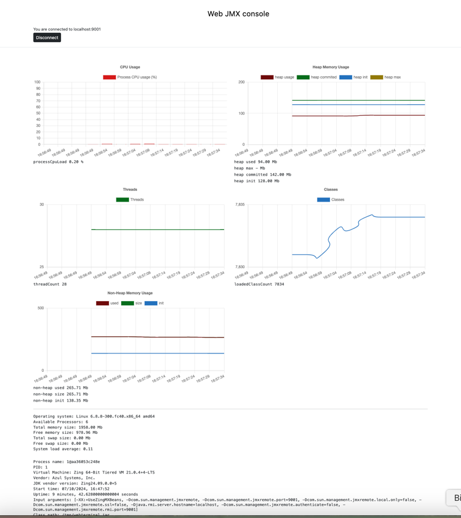

# Web JMX console

A simple web based one-page application that contains the main features of standard JDK jconsole.
If allows to get JMX metrics using RMI connection and local attach API (with some limitations)
The heap memory, thread count, non-heap memory etc metrics are represented as charts.
for visual convenience.
Besides traditional JDK implementations (based on OpenJDK) this tool supports JMX monitoring of Azul Zing VM instances using Zing specific JMX API (for getting actual heap usage metrics).



### System requirements
 - JDK 21
 - Note: n order to receive Azul Zing JDK metrics the application requires `ZingJMM.jar` in the classpath.
This library can be obtained from  Azul Zing JDK stream builds that are free for development and testing purposes. 
The instruction on how to receive the builds is here https://docs.azul.com/prime/installation-and-configuration
   `ZingJMM.jar`  can be obtained from $ZING_HOME/etc/extensions/mxbeans/agents/ZingJMM.jar

### How to use
   - Clone this repo 
     ```
     $ git clone https://github.com/kriffer/web-jmx-console.git
     ```
   - Once you get stream build of Azul Zing JDK, locate `$ZING_HOME/etc/extensions/mxbeans/agents/ZingJMM.jar` and add that to your local maven repository: 
   
     ```
     $ mvn install:install-file \
     -Dfile=$ZING_HOME/etc/extensions/mxbeans/agents/ZingJMM.jar \
     -DgroupId=com.azul \
     -DartifactId=zing-jmm \
     -Dversion=1.0 \
     -Dpackaging=jar
      ```

   - Build the project:
      ````
      $ cd web-jmx-console && mvn clean install
       ````
 
   - Run the application:
     ````
     $ java -jar web-jmx-console.jar
     ````

### Configuration
The list of remote connections can be set in application.properties 
in format:
``` 
app.data.connection[0].host=host1
app.data.connection[0].port=9998
app.data.connection[1].host=host2
app.data.connection[1].port=9999
```
or can be added as a command line parameter to the process:
``` 
java -Dapp.data.connection[0].host=localhost -Dapp.data.connection[0].port=9998 -jar web-jmx-console.jar
```

